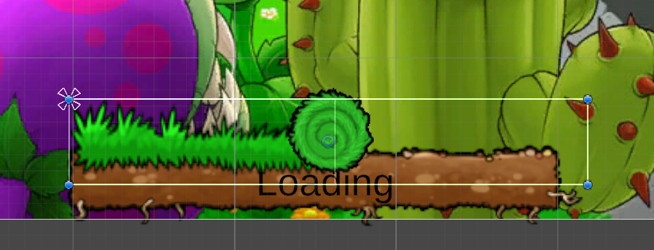
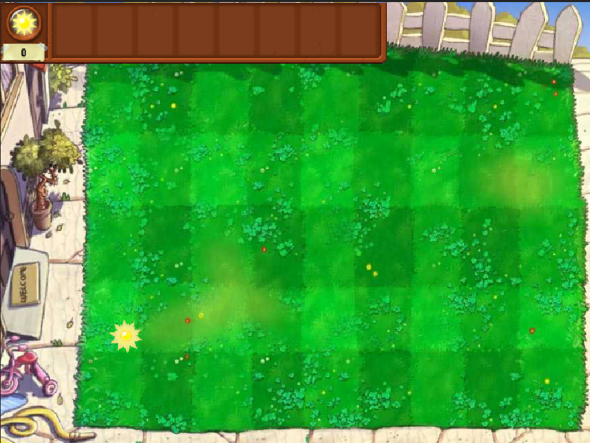
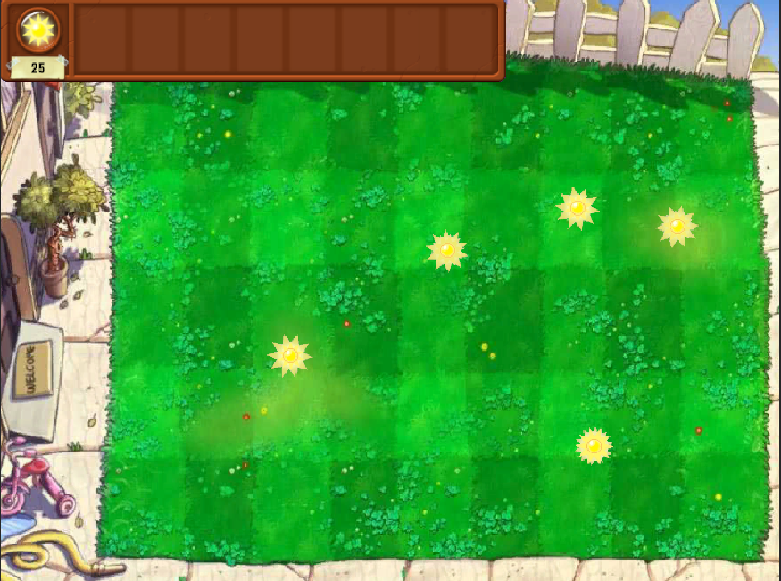
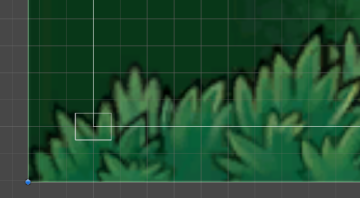
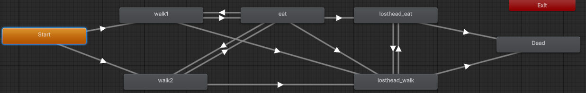

Develop Log

---

# Plants Vs Zombies - Version Garry

描述:

该项目是Garry用于学习Unity游戏引擎和C#语言的项目。


---
---

## Date : 2025 - 11 - 28

#### 开发记录 :

1. 加载界面的搭建
2. 加载界面加载效果的搭建

#### 学习记录：

Q: 如何实现类似随时间变化的， 进度条的动画实现？

A: 可以预先设定一个图，用作加载好的进度条图像， 然后创建一个空GameObject， 作为进度条图像的父类， 然后对父类GameObject添加Rect Mask 2D 组件， 并将父类的透明度设置为0， 则此时， 则可以通过控制父类GameObject的显示范围来控制对其子类GameObject的遮罩效果


```
private void LoadingBarUpdate()
{
    currentLoadingBarGrassMaskWidth = math.min(currentLoadingBarGrassMaskWidth + loadingBarGrassMaskSpeed * Time.deltaTime, loadingBarGrassMaskMaxWidth);
    currentLoadingBarGrassRollPositionX = math.min(currentLoadingBarGrassRollPositionX + loadingBarGrassRollSpeed * Time.deltaTime, loadingBarGrassRollEndPositionX);
    SetMaskWidth(currentLoadingBarGrassMaskWidth);
    SetRollPosX(currentLoadingBarGrassRollPositionX);
    if(!isLoadingBarComplete && currentLoadingBarGrassRollPositionX == loadingBarGrassRollEndPositionX && currentLoadingBarGrassMaskWidth == loadingBarGrassMaskMaxWidth)
    {
        isLoadingBarComplete = true;
        SetLoadingBarGrassRollInvisible();
        UpdateLoadingButton();
        EnableLoadingButton();
    }
} 
```

Q: 如何实现一个AudioManager 来管理游戏内的相关音效的播放？

A: 通过继承ScriptableObject， 实现音效素材类。通过继承ScriptableObject，是一个可独立于类实例来保存大量数据的数据容器。ScriptableObject 的一个主要用例是通过避免重复值来减少项目的内存使用量。如果项目有一个预制件在附加的 MonoBehaviour 脚本中存储不变的数据，这将非常有用。

每次实例化预制件时，都会产生单独的数据副本。这种情况下可以不使用该方法并且不存储重复数据，而是使用 ScriptableObject 来存储数据，然后通过所有预制件的引用访问数据。这意味着内存中只有一个数据副本。（有点类似于 享元模式， 这里ScirptableObject的作用是将需要复用的资源单独抽离出来作为单独的资源， 需要的Prefab去引用该资源，而不是创建一个全新的资源副本）

```
public class SoundEffect : ScriptableObject
{
    public SoundEffectType type = SoundEffectType.Bgm;
    public AudioClip[] clips;

    public AudioClip GetRandomClip()
    {
        if (clips.Length == 0) return null;
        return clips[Random.Range(0, clips.Length)];
    }
}
```

AudioManager:
目前， AudioManager 实现了 ：
1. 播放BGM
2. 停止BGM
3. 定点播放音效
等功能， 并同一时间限制只能同时播放一个BGM， 音效则无此类限制。

Q: AudioListener， AudioSource， AudioMixer 的区别

A:
AudioSource ： 即， 音效文件在3D中的表现， 
AudioListener ： 即， 模拟麦克风录制游戏空间中出现的音效表现， 并通过设备的音频输出设备输出。
AudioMixer： 混音器（暂未使用） 

---

## Date： 2025 - 11 - 30 


#### 学习记录：

Q: 如何实现类似多个子类公用一套动画状态机， 例如： Idle， Run， Attack， 但不同子类同一状态下播放不同的动画？

A: Animator Override Controller
以下介绍来自于[Unity Documentation](https://docs.unity.cn/cn/2018.4/Manual/AnimatorOverrideController.html):

Animator Override Controller 是一种资源，它可让您扩展现有 Animator Controller，从而替换使用的特定动画但保留其原始结构、参数和逻辑。

因此，您可以创建同一个基本状态机的多个变体，但是每个变体使用不同的动画集。例如，您的游戏可能有各种各样的 NPC 类角色生活在世界上，但每种类型（小妖精、恶魔、小精灵等）都有自己独特的行走、空闲、坐定等动画。

通过创建一个包含所有 NPC 类型角色逻辑的“基础”Animator Controller，即可为每种角色类型创建一个重写，并放入各自的动画文件。

---

## Date： 2025 - 12 - 02 

#### 开发记录：
完成了豌豆射手的制作， 豌豆子弹的制作， 豌豆子弹碰撞的功能， 以及豌豆子弹碰撞后的特效（淡出）

在AudioManager中加入了一个新的方法， 用于在指定的音频起始时间点开始播放音效

```Csharp
    GameObject gameObject = new GameObject("One shot audio");
    gameObject.transform.position = _listener.transform.position;
    AudioSource audioSource = (AudioSource)gameObject.AddComponent(typeof(AudioSource));
    AudioClip clip = effect.GetRandomClip();
    audioSource.clip = clip;
    audioSource.spatialBlend = 1f;
    audioSource.time = time;
    audioSource.volume = volume;
    audioSource.Play();
    Object.Destroy(gameObject, clip.length * ((Time.timeScale < 0.01f) ? 0.01f : Time.timeScale));
```


#### 学习记录：

Q: 如何实现物体的碰撞检测？

A: 2D游戏中的碰撞触发一共两种情况：
1. OnTriggerEnter2D：
要求
    1. 双方都有碰撞体
    2. 运动的一方必须是刚体
    3. 至少一方勾选Trigger触发器

2. OnCollisionEnter：
要求：
    1. 双方都有碰撞体
    2. 运动的一方必须有刚体
    3. 双方不可同时勾选Kinematic运动学。
    4. 双方都不可勾选Trigger触发器。

---

## Date： 2025 - 12 - 03

#### 开发记录：
完成了阳光， 阳光管理器， 阳光数值显示文本和待种植植物的卡片槽位的UI



实现了阳光收集功能， 并实现了阳光点击后，先快后慢的移动到阳光栏的移动功能。
```Csharp
    private void MoveUpdate()
    {
        curMoveTargetTime += Time.deltaTime;
        if(curMoveTargetTime >= moveTargetMaxTime)
        {
            curMoveTargetTime = moveTargetMaxTime;
        }
        Vector3 moveStepVector = startMoveSpeed * curMoveTargetTime / 2 / moveTargetMaxTime * (2 * moveTargetMaxTime - curMoveTargetTime) + moveStartPosition - transform.position;
        transform.Translate(moveStepVector);
    } 
```
公式：
$$
有 \ \ moveTargetMaxTime  = t_0 \\ 则 该运动需要在t_0时间内匀减速运动到目标位置\ \ targetPosition \\ 又， 移动距离 S = v_0t - \frac{a t^2}{2} \\ 得到 v_0 = \frac{2S}{t_0} \\ 故 t 时刻阳光相对于移动起始位置的位置为：\\ s(t) = v_0t - \frac{a}{2} t^2 = v_0t-\frac{v_0}{2t^0}t^2 = \frac{v_0t}{2t_0}(2t_0 - t) \\ t时刻，阳光的具体位置为 s(t) + moveStartPosition\\ 要传入 transform.Translate方法的移动距离就是 \\ s(t) + moveStartPosition - transform.position;
$$

实现了正常游戏状态下，阳光能够自然生成并掉落在地图的随机位置



---


## Date： 2025 - 12 - 04

#### 开发记录：

1. 为SunPoint 类添加了受到重力影响的自然掉落的方法，用于生产阳光的植物生成SunPoint
2. 重构了Level-test中调用AudioManager的方法， 使Unity直接加载Level-test场景时， 不会因为AudioManager未被初始化而影响功能方法的正常运行
3. 为SunManager添加了对所有场景中阳光的管理List， 并限制了同一时刻，场景内阳光总数的最大值。
4. 开始编写ProductPlant 生产型植物的基类， 该类植物用于生产资源，如（阳光， 金币等）
5. 为Level-test添加了返回到MenuScene的按钮， 并添加了MenuScene的Bgm


---


## Date： 2025 - 12 - 05

#### 开发记录：

1. 重新设置了Game 的分辨率： 4：3 aspect -> 800x600 
2. 完成了太阳花（Sunflower）的创建， 完成了自动生产阳光的功能， 并将太阳花生成的阳光也添加到SunManager中的sunPoints的List， 便于管理
3. 为Level-test添加了一个测试按钮， 以及SunManager中的方法， CollectAllSunPoint用于一键将场景中的阳光全部收集（便于测试）

#### 学习记录

Q: 为何每次重新打开项目，不定时的， 会出现场景下的UI会出现缩放错位的情况：如图：


A: 原因：Game视窗下，之前的分辨率设置为了4：3 aspect ， 会自动根据屏幕的分辨率进行自适应修改， 但这个修改不知为何并没有同步缩放我放置在UI中的组件， 所以会出现这种错位。 将分辨率修改为了固定了800x600， 问题解决


---

## Date: 2025 - 12 - 06

#### 开发记录

1. 完成了僵尸的模板类， 和普通僵尸的动画及相应的功能
2. 完成了僵尸的攻击与受击， 植物的攻击与受击功能
3. 完成了普通僵尸的动画状态机的搭建
4. 修复了植物没有血量和死亡状态的问题
5. 完成了豌豆子弹无法对僵尸正确攻击问题




---

## Date: 2025 - 12 - 11

#### 开发记录
1. 为场景添加了对应了种植槽位 Cell， 为了便于管理， 设计了CellRow 用于包含一整行的Cell， 设计了CellList， 用于管理多个CellRow


---

## Date: 2025 - 12 - 12

#### 开发记录
1. 为卡片栏位添加了豌豆射手和向日葵的种植卡， 并完成了种植卡牌的基础功能：状态切换，以及阳光消费的检测
2. 为植物添加了cost成员， 用于记录对应植物种植需要花费的阳光点数

