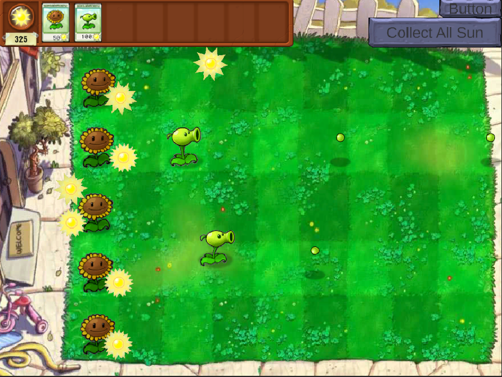
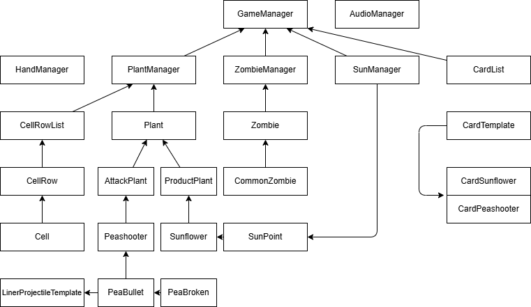

Develop Log

---

# Plants Vs Zombies - Version Garry

描述:

该项目是Garry用于学习Unity游戏引擎和C#语言的项目。


---
---

## Date : 2025 - 11 - 28

#### 开发记录 :

1. 加载界面的搭建
2. 加载界面加载效果的搭建

#### 学习记录：

Q: 如何实现类似随时间变化的， 进度条的动画实现？

A: 可以预先设定一个图，用作加载好的进度条图像， 然后创建一个空GameObject， 作为进度条图像的父类， 然后对父类GameObject添加Rect Mask 2D 组件， 并将父类的透明度设置为0， 则此时， 则可以通过控制父类GameObject的显示范围来控制对其子类GameObject的遮罩效果


```
private void LoadingBarUpdate()
{
    currentLoadingBarGrassMaskWidth = math.min(currentLoadingBarGrassMaskWidth + loadingBarGrassMaskSpeed * Time.deltaTime, loadingBarGrassMaskMaxWidth);
    currentLoadingBarGrassRollPositionX = math.min(currentLoadingBarGrassRollPositionX + loadingBarGrassRollSpeed * Time.deltaTime, loadingBarGrassRollEndPositionX);
    SetMaskWidth(currentLoadingBarGrassMaskWidth);
    SetRollPosX(currentLoadingBarGrassRollPositionX);
    if(!isLoadingBarComplete && currentLoadingBarGrassRollPositionX == loadingBarGrassRollEndPositionX && currentLoadingBarGrassMaskWidth == loadingBarGrassMaskMaxWidth)
    {
        isLoadingBarComplete = true;
        SetLoadingBarGrassRollInvisible();
        UpdateLoadingButton();
        EnableLoadingButton();
    }
} 
```

Q: 如何实现一个AudioManager 来管理游戏内的相关音效的播放？

A: 通过继承ScriptableObject， 实现音效素材类。通过继承ScriptableObject，是一个可独立于类实例来保存大量数据的数据容器。ScriptableObject 的一个主要用例是通过避免重复值来减少项目的内存使用量。如果项目有一个预制件在附加的 MonoBehaviour 脚本中存储不变的数据，这将非常有用。

每次实例化预制件时，都会产生单独的数据副本。这种情况下可以不使用该方法并且不存储重复数据，而是使用 ScriptableObject 来存储数据，然后通过所有预制件的引用访问数据。这意味着内存中只有一个数据副本。（有点类似于 享元模式， 这里ScirptableObject的作用是将需要复用的资源单独抽离出来作为单独的资源， 需要的Prefab去引用该资源，而不是创建一个全新的资源副本）

```
public class SoundEffect : ScriptableObject
{
    public SoundEffectType type = SoundEffectType.Bgm;
    public AudioClip[] clips;

    public AudioClip GetRandomClip()
    {
        if (clips.Length == 0) return null;
        return clips[Random.Range(0, clips.Length)];
    }
}
```

AudioManager:
目前， AudioManager 实现了 ：
1. 播放BGM
2. 停止BGM
3. 定点播放音效
等功能， 并同一时间限制只能同时播放一个BGM， 音效则无此类限制。

Q: AudioListener， AudioSource， AudioMixer 的区别

A:
AudioSource ： 即， 音效文件在3D中的表现， 
AudioListener ： 即， 模拟麦克风录制游戏空间中出现的音效表现， 并通过设备的音频输出设备输出。
AudioMixer： 混音器（暂未使用） 

---

## Date： 2025 - 11 - 30 


#### 学习记录：

Q: 如何实现类似多个子类公用一套动画状态机， 例如： Idle， Run， Attack， 但不同子类同一状态下播放不同的动画？

A: Animator Override Controller
以下介绍来自于[Unity Documentation](https://docs.unity.cn/cn/2018.4/Manual/AnimatorOverrideController.html):

Animator Override Controller 是一种资源，它可让您扩展现有 Animator Controller，从而替换使用的特定动画但保留其原始结构、参数和逻辑。

因此，您可以创建同一个基本状态机的多个变体，但是每个变体使用不同的动画集。例如，您的游戏可能有各种各样的 NPC 类角色生活在世界上，但每种类型（小妖精、恶魔、小精灵等）都有自己独特的行走、空闲、坐定等动画。

通过创建一个包含所有 NPC 类型角色逻辑的“基础”Animator Controller，即可为每种角色类型创建一个重写，并放入各自的动画文件。

---

## Date： 2025 - 12 - 02 

#### 开发记录：
完成了豌豆射手的制作， 豌豆子弹的制作， 豌豆子弹碰撞的功能， 以及豌豆子弹碰撞后的特效（淡出）

在AudioManager中加入了一个新的方法， 用于在指定的音频起始时间点开始播放音效

```Csharp
    GameObject gameObject = new GameObject("One shot audio");
    gameObject.transform.position = _listener.transform.position;
    AudioSource audioSource = (AudioSource)gameObject.AddComponent(typeof(AudioSource));
    AudioClip clip = effect.GetRandomClip();
    audioSource.clip = clip;
    audioSource.spatialBlend = 1f;
    audioSource.time = time;
    audioSource.volume = volume;
    audioSource.Play();
    Object.Destroy(gameObject, clip.length * ((Time.timeScale < 0.01f) ? 0.01f : Time.timeScale));
```


#### 学习记录：

Q: 如何实现物体的碰撞检测？

A: 2D游戏中的碰撞触发一共两种情况：
1. OnTriggerEnter2D：
要求
    1. 双方都有碰撞体
    2. 运动的一方必须是刚体
    3. 至少一方勾选Trigger触发器

2. OnCollisionEnter：
要求：
    1. 双方都有碰撞体
    2. 运动的一方必须有刚体
    3. 双方不可同时勾选Kinematic运动学。
    4. 双方都不可勾选Trigger触发器。

---

## Date： 2025 - 12 - 03

#### 开发记录：
完成了阳光， 阳光管理器， 阳光数值显示文本和待种植植物的卡片槽位的UI


实现了阳光收集功能， 并实现了阳光点击后，先快后慢的移动到阳光栏的移动功能。
```Csharp
    private void MoveUpdate()
    {
        curMoveTargetTime += Time.deltaTime;
        if(curMoveTargetTime >= moveTargetMaxTime)
        {
            curMoveTargetTime = moveTargetMaxTime;
        }
        Vector3 moveStepVector = startMoveSpeed * curMoveTargetTime / 2 / moveTargetMaxTime * (2 * moveTargetMaxTime - curMoveTargetTime) + moveStartPosition - transform.position;
        transform.Translate(moveStepVector);
    } 
```
公式：
$$
有 \ \ moveTargetMaxTime  = t_0 \\ 则 该运动需要在t_0时间内匀减速运动到目标位置\ \ targetPosition \\ 又， 移动距离 S = v_0t - \frac{a t^2}{2} \\ 得到 v_0 = \frac{2S}{t_0} \\ 故 t 时刻阳光相对于移动起始位置的位置为：\\ s(t) = v_0t - \frac{a}{2} t^2 = v_0t-\frac{v_0}{2t^0}t^2 = \frac{v_0t}{2t_0}(2t_0 - t) \\ t时刻，阳光的具体位置为 s(t) + moveStartPosition\\ 要传入 transform.Translate方法的移动距离就是 \\ s(t) + moveStartPosition - transform.position;
$$

实现了正常游戏状态下，阳光能够自然生成并掉落在地图的随机位置


---


## Date： 2025 - 12 - 04

#### 开发记录：

1. 为SunPoint 类添加了受到重力影响的自然掉落的方法，用于生产阳光的植物生成SunPoint
2. 重构了Level-test中调用AudioManager的方法， 使Unity直接加载Level-test场景时， 不会因为AudioManager未被初始化而影响功能方法的正常运行
3. 为SunManager添加了对所有场景中阳光的管理List， 并限制了同一时刻，场景内阳光总数的最大值。
4. 开始编写ProductPlant 生产型植物的基类， 该类植物用于生产资源，如（阳光， 金币等）
5. 为Level-test添加了返回到MenuScene的按钮， 并添加了MenuScene的Bgm


---


## Date： 2025 - 12 - 05

#### 开发记录：

1. 重新设置了Game 的分辨率： 4：3 aspect -> 800x600 
2. 完成了太阳花（Sunflower）的创建， 完成了自动生产阳光的功能， 并将太阳花生成的阳光也添加到SunManager中的sunPoints的List， 便于管理
3. 为Level-test添加了一个测试按钮， 以及SunManager中的方法， CollectAllSunPoint用于一键将场景中的阳光全部收集（便于测试）

#### 学习记录

Q: 为何每次重新打开项目，不定时的， 会出现场景下的UI会出现缩放错位的情况：如图：


A: 原因：Game视窗下，之前的分辨率设置为了4：3 aspect ， 会自动根据屏幕的分辨率进行自适应修改， 但这个修改不知为何并没有同步缩放我放置在UI中的组件， 所以会出现这种错位。 将分辨率修改为了固定了800x600， 问题解决


---

## Date: 2025 - 12 - 06

#### 开发记录

1. 完成了僵尸的模板类， 和普通僵尸的动画及相应的功能
2. 完成了僵尸的攻击与受击， 植物的攻击与受击功能
3. 完成了普通僵尸的动画状态机的搭建
4. 修复了植物没有血量和死亡状态的问题
5. 完成了豌豆子弹无法对僵尸正确攻击问题


---

## Date: 2025 - 12 - 11

#### 开发记录
1. 为场景添加了对应了种植槽位 Cell， 为了便于管理， 设计了CellRow 用于包含一整行的Cell， 设计了CellList， 用于管理多个CellRow


---

## Date: 2025 - 12 - 12

#### 开发记录
1. 为卡片栏位添加了豌豆射手和向日葵的种植卡， 并完成了种植卡牌的基础功能：状态切换，以及阳光消费的检测
2. 为植物添加了cost成员， 用于记录对应植物种植需要花费的阳光点数
3. 添加了HandManager 类， 用于管理鼠标的操作， 例如： 植物种植卡片的点击， 植物的种植等
4. 完成了正常游戏过程中植物的种植操作
5. 添加了ZombieManager单例类，用于管理场景中僵尸的生成和每行僵尸的添加和销毁
6. 为LevelSceneController添加了对僵尸和植物交互的相关控制， 现在攻击型植物仅在当前行中有僵尸（敌人）时发起攻击。





#### 学习记录

Q：如何通过代码， 获取当前脚本挂载对象的子对象
A：
方式1：通过Find方法， 查找指定名称的子物体(可以使用层级的路径)
```
transform.Find("ChildCube")?.gameObject;
transform.Find("ChildGroup/GrandChildSphere")?.gameObject;
```

方式2: 通过GetChild() 方法， 按照顺序获取子对象
```
father.transform.GetChild(i);
```

Q: 如何通过代码， 判断当前的实例是否是某一类的子类
A: IsSubClassOf
```
Plant curPlant = cellMatrix.cellRows[idx].cells[i].currentPlant.GetComponent<Plant>() ;
if (curPlant.GetType().IsSubclassOf(typeof(AttackPlant)))
{
    AttackPlant atkPlant = (AttackPlant) curPlant;
    atkPlant.canAttack = false;
}
```

---
## Date: 2025 - 12 - 13

#### 开发记录
1. 为关卡场景添加不同状态，完成游戏开始时摄像机的左右移动，展示地图
2. 为ZombieManager和PlantManager添加了方法，用于管理场景中的植物和僵尸， 例如， 游戏结束时， 场景中所有僵尸和植物应当停止动画
3. 修复了因为僵尸碰撞箱较高导致会对上一行的植物发生碰撞进行攻击的Bug
4. 完成了僵尸碰撞到房屋导致的游戏结束阶段：音乐播放， UI展示
5. 完成了所有僵尸被击杀后， 游戏胜利的音乐播放。


---
---
# Phase 1 Complete
## Date: 2025 - 12 - 13

### 总结
1. 初步学习了关于Unity开发2D游戏的操作流程
2. 学习了有关于游戏开发过程中的知识
3. 了解到了关于Unity开发游戏过程中一些常见的操作实现的具体细节
4. 复习了关于游戏开发过程中需要用到的公式与计算方法
5. 第一次完成对一个整体项目结构的完整设计

#### 简要结构示意图



### 总结不足

1. 对项目的结构没有一个清晰的认识， 原因在于项目和游戏开发的经验过少， 在项目开始的初期并没有对项目整体的结构有着一个完整、清晰的设计， 通常是， 想到一个功能或是需要某个功能了才回去找到对应的类中添加方法与字段。
2. 项目中各个类的设计耦合严重， 代码结构混乱， 没有一个完整的设计， 并且并未能够熟练的使用面向对象设计来实现高效、简明的代码编写
3. 对C#语言的语法与功能不明确，基本上是只了解基础语法， 并未了解到高级功能
